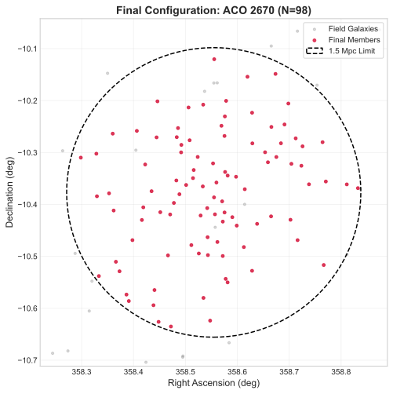
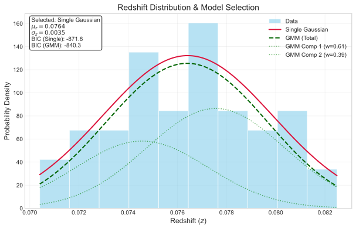
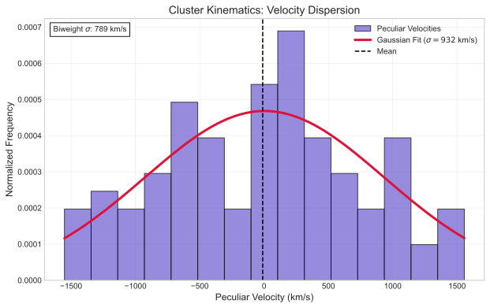
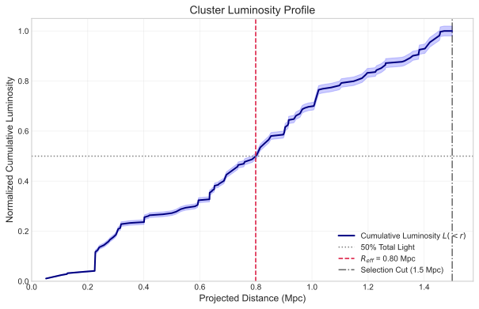

# Galaxy Cluster Dark Matter Analysis: ACO 2670

[](../README.md)

[](https://github.com/JacksonFergusonDev/data-science-portfolio/actions/workflows/ci.yml)


**A computational astrophysics pipeline estimating the virial mass and mass-to-light ratio of galaxy cluster ACO 2670 using SDSS DR18 data.**

📄 **[Read the Full Technical Report (PDF)](aco_2670_dark_matter_analysis_report.pdf)**

💻 **[View the Analysis Notebook](aco_2670_dark_matter_analysis.ipynb)**

---

## 🎯 Project Overview
This project quantifies the dark matter content of a rich galaxy cluster by analyzing the kinematics of 98 member galaxies. It implements a robust statistical pipeline to isolate cluster members from foreground/background noise and applies the Virial Theorem to estimate the total dynamical mass.

**Key Result:** The cluster has a Mass-to-Light ratio of **$291 \pm 60 M_{\odot}/L_{\odot}$**, confirming that non-luminous dark matter constitutes >95% of its total mass.

---

## 📊 Key Visualizations

### 1. Membership Selection & Morphology
*The iterative sigma-clipping algorithm converged on a stable core of 98 galaxies (red), successfully isolating the cluster from the background field (gray).*

<p float="left">
  
  
</p>

* **Left:** Final spatial configuration showing the 1.5 Mpc physical selection radius (dashed).
* **Right:** Redshift distribution analysis. The data favors a single Gaussian profile (red) over a mixture model, indicating the cluster is likely virialized and not currently undergoing a major merger.

### 2. Kinematics & Structure
*By measuring how fast galaxies move and how light is distributed, we constrain the cluster's mass.*

<p float="left">
  
  
</p>

* **Left:** Peculiar velocity dispersion ($\sigma_v \approx 932$ km/s). The width of this histogram is the direct proxy for the cluster's gravitational potential.
* **Right:** Cumulative luminosity profile used to determine the Effective Radius ($R_{eff} \approx 1.07$ Mpc), encompassing 50% of the cluster's light.

---

## 🛠️ Technical Implementation

The analysis is built in **Python** using a modular functional approach. Key computational techniques include:

### Data Pipeline & Cleaning
* **Iterative Sigma-Clipping:** Developed a convergence algorithm that iteratively refines cluster membership based on radial velocity ($3\sigma$ cuts) and projected distance ($1.5 \text{ Mpc}$).
* **Cosmology:** Utilizes `astropy.cosmology` (Planck 2018) for accurate relativistic distance calculations ($D_A$ vs $D_L$).

### Statistical Modeling
* **Velocity Dispersion:** Estimated using both **Gaussian Maximum Likelihood** and **Biweight Midvariance** (a robust estimator insensitive to outliers).
* **Substructure Detection:** Implemented **Gaussian Mixture Models (GMM)** and evaluated model fit using the **Bayesian Information Criterion (BIC)**.

### Photometry & Mass Modeling
* **Luminosity Function:** Converted apparent magnitudes to absolute solar luminosities ($L_{\odot}$) using distance moduli.
* **Virial Mass:** Calculated assuming isotropic orbits and a spherical mass distribution ($M \approx 3 \sigma_v^2 r_{1/2} G^{-1}$)

---

## 📊 Final Results Summary

| Parameter | Value | Uncertainty | Description |
| :--- | :--- | :--- | :--- |
| **Member Count** | 98 | - | Final galaxy count after convergence |
| **Velocity Dispersion** | 932 km/s | $\pm 95$ | Line-of-sight velocity spread ($\sigma_v$) |
| **Virial Mass** | $6.45 \times 10^{14} M_{\odot}$ | $\pm 1.31$ | Total gravitating mass |
| **Mass-to-Light Ratio** | **291 $M_{\odot}/L_{\odot}$** | $\pm 60$ | **Evidence for Dark Matter** |

---

## 🚀 Quick Start

This project is part of my Data Science Portfolio. To reproduce the analysis:

1.  **Clone the portfolio repository:**
    ```bash
    git clone https://github.com/JacksonFergusonDev/data-science-portfolio.git
    cd data-science-portfolio
    ```

2.  **Environment Setup:**

    **Modern (Recommended):**
    This project is managed with [uv](https://github.com/astral-sh/uv). This will automatically handle Python versioning and virtual environments.
    ```bash
    # Sync dependencies and build the environment
    uv sync
    ```

    **Legacy (pip):**
    If you do not have `uv` installed, you can use standard pip:
    ```bash
    pip install -r requirements.txt
    ```

3.  **Launch the Astrophysics analysis:**
    ```bash
    cd astrophysics
    jupyter notebook aco_2670_dark_matter_analysis.ipynb
    ```

---

### Author
**Jackson Ferguson** *Astrophysics Undergraduate, University of Victoria*

[LinkedIn](https://www.linkedin.com/in/jackson--ferguson/) | [GitHub](https://github.com/JacksonFergusonDev)
