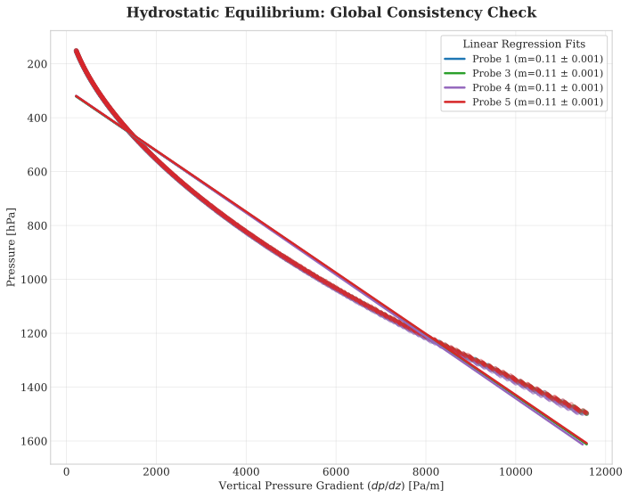
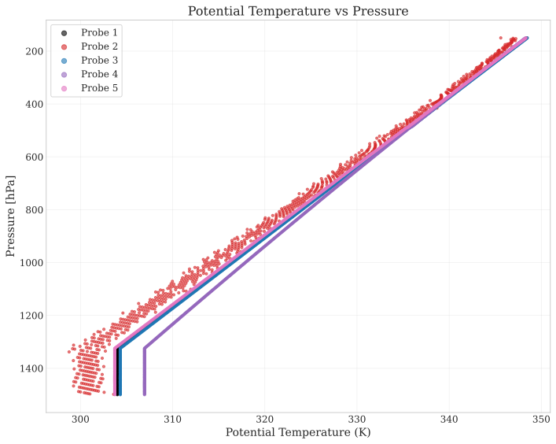
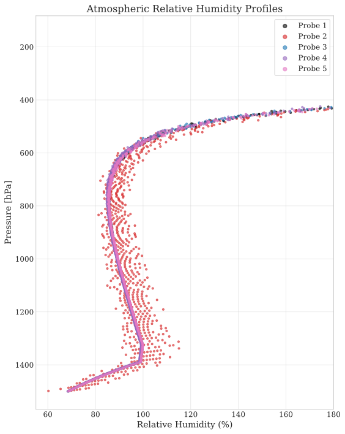

# Exoplanet Atmospheric Analysis Pipeline

[](../README.md)

[](https://github.com/JacksonFergusonDev/data-science-portfolio/actions/workflows/ci.yml)


**A computational atmospheric science pipeline reconstructing the thermodynamic profile and stability of a high-gravity exoplanet using descent probe telemetry.**

💻 **[View the Analysis Notebook](exoplanet_atmospheric_analysis.ipynb)**

---

## 🎯 Project Overview

This project analyzes telemetry data from five descent probes deployed into the atmosphere of a hypothetical high-gravity exoplanet ($g = 20 \, \text{m/s}^2$). By processing raw sensor data (pressure, temperature, density), the pipeline reconstructs the atmospheric structure, validates hydrostatic equilibrium, and derives key hydrological parameters.

**Data Source:** The analysis is performed on a **synthetic dataset** generated for an upper-level atmospheric physics curriculum. The data includes simulated sensor noise, invalid readings, and gaps to test the robustness of the data cleaning and integration algorithms.

**Key Insight:** The analysis reveals a stable, well-mixed troposphere with a global mean precipitation rate of **$0.086 \pm 0.013 \text{ mm/hr}$**, suggesting a hydrological cycle significantly less vigorous than Earth's despite the high gravity.

---

## 🧮 Theoretical Framework

The pipeline implements a numerical solver for the fundamental equations of atmospheric physics to validate sensor data and derive secondary parameters.

### 1. Hydrostatic Equilibrium
We validate the mechanical stability of the atmosphere by comparing the observed vertical pressure gradient against the theoretical prediction for an ideal gas mixture:

$$\frac{dp}{dz} = -\rho g = -\frac{P \cdot \mu}{R \cdot T} g$$

Where $\mu$ (Mean Molar Mass) is derived via the harmonic mean of the constituent mass fractions.

### 2. Radiative Transfer (Optical Depth)
To determine the atmospheric opacity, we calculate the optical depth ($\tau$) by integrating the extinction coefficient ($\beta$) from the top of the atmosphere ($P=0$) down to surface pressure ($P_s$):

$$\tau(z) = \int_{0}^{P_s} \frac{\beta(\nu, z)}{\rho(z) g} \, dp$$

### 3. Global Hydrology
The global precipitation rate ($P$) is derived from the shortwave energy budget ($F_{SW}$) and the latent heat of vaporization ($L_v$), solving for the steady-state mass flux required to balance radiative heating:

$$P = \frac{F_{SW} \cdot (1 - \alpha)}{L_v}$$

---

## 📊 Key Visualizations

### 1. Stability & Structure
*We validate the mechanical stability of the atmosphere and reconstruct missing sensor data using physical laws.*

<p float="left">
  
  
</p>

* **Left:** Hydrostatic Equilibrium Verification. The linear relationship between pressure ($P$) and vertical gradient ($dp/dz$) across all five probes confirms the atmosphere is in global hydrostatic balance.
* **Right:** Temperature Profile Reconstruction. By inverting the hydrostatic equation, we successfully recovered missing temperature data (red) for Probe 2, validating it against the other probes.

### 2. Hydrology & Thermodynamics
*Derived parameters characterizing the planet's water cycle and opacity.*

<p align="center">
  
</p>

* Relative Humidity Profile. The vertical distribution of humidity shows a clear structure, allowing us to integrate the total precipitable water vapor (PWV) and estimate the opacity ($\tau$) of the atmosphere to infrared radiation.

---

## 📉 Final Results Summary

The computational analysis yielded the following constraints on the planetary atmosphere:

| Parameter | Value | Uncertainty | Description |
| :--- | :--- | :--- | :--- |
| **Surface Gravity** | $20.0 \, \text{m/s}^2$ | - | Planet-specific constant |
| **Mean Molar Mass** | $19.75 \, \text{g/mol}$ | $\pm 0.03$ | Derived composition |
| **Specific Heat ($C_p$)**| $1308.40 \, \text{J/(kg K)}$ | - | Mean atmospheric heat capacity |
| **Mean Lapse Rate** | $15.29 \, \text{K/km}$ | - | Dry adiabatic cooling rate |
| **Precipitable Water** | $41.16 \, \text{kg/m}^2$ | $\pm 3.60$ | Integrated column mass |
| **Precipitation Rate** | $0.0864 \, \text{mm/hr}$ | $\pm 0.0127$ | Global mean rainfall |
| **Residence Time** | $19.85 \, \text{Days}$ | $\pm 3.40$ | Atmospheric water turnover |

---

## 🛠️ Tech Stack & Methods

**Stack**
* **Python 3.11+**
* **Libraries:** `NumPy` (Vectorized physics calculations), `Matplotlib` (Visualization), `SciPy` (Physical constants)

**Scientific Methods**
* **Thermodynamics:** Derivation of temperature via Hydrostatic Equation, Clausius-Clapeyron relation for Relative Humidity.
* **Atmospheric Dynamics:** Finite difference approximation for vertical pressure gradients ($dp/dz$) and stability verification via linear regression.
* **Radiative Transfer:** Vertical integration of optical depth ($\tau$) using the Trapezoidal rule.
* **Composition:** Harmonic mean calculation for atmospheric mean molar mass ($\mu$).

---

## 🚀 Quick Start

To reproduce this analysis locally:

1.  **Clone the portfolio repository:**
    ```bash
    git clone https://github.com/JacksonFergusonDev/data-science-portfolio.git
    cd data-science-portfolio
    ```

2.  **Environment Setup:**

    **Modern (Recommended):**
    This project is managed with [uv](https://github.com/astral-sh/uv). This will automatically handle Python versioning and virtual environments.
    ```bash
    # Sync dependencies and build the environment
    uv sync
    ```

    **Legacy (pip):**
    If you do not have `uv` installed, you can use standard pip:
    ```bash
    pip install -r requirements.txt
    ```

3.  **Launch the Atmospheric Science analysis:**
    ```bash
    cd atmospheric_science
    jupyter notebook exoplanet_atmospheric_analysis.ipynb
    ```

---

### Author
**Jackson Ferguson** *Astrophysics Undergraduate, University of Victoria*

[LinkedIn](https://www.linkedin.com/in/jackson--ferguson/) | [GitHub](https://github.com/JacksonFergusonDev)
