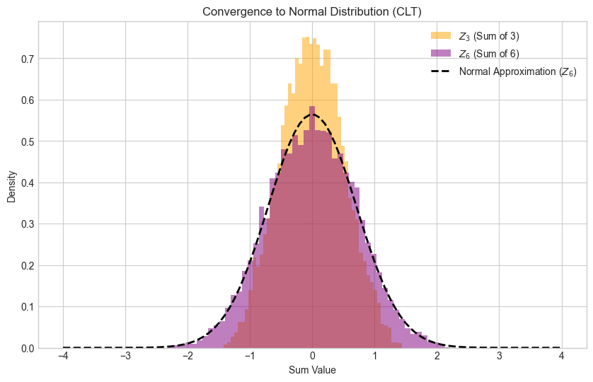
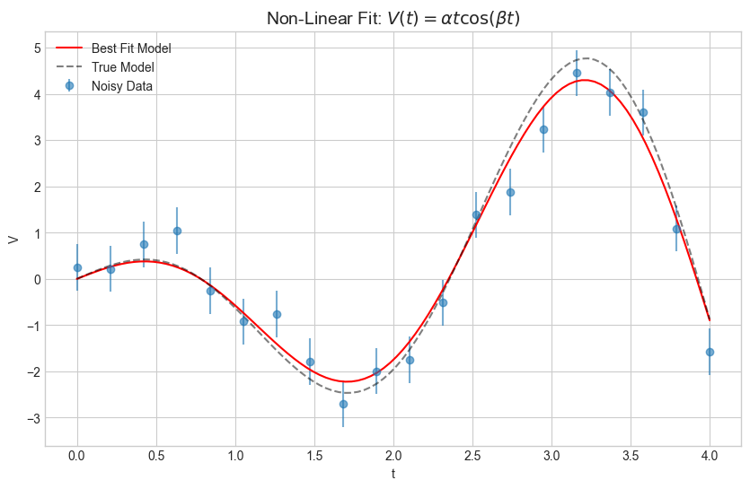
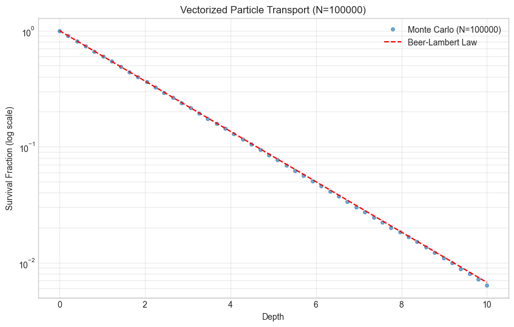

# Monte Carlo Simulation and Statistical Inference

[](../README.md)


💻 **[View the Full Notebook](monte_carlo_simulation_and_statistical_inference.ipynb)**

This project bridges the gap between theoretical statistics and computational physics. By implementing stochastic processes from scratch, this notebook demonstrates how Monte Carlo methods can be used to simulate physical systems, quantify uncertainty, and perform robust statistical inference without relying on "black box" solutions.

The analysis moves from fundamental probability theory to applied particle transport simulation, culminating in non-linear parameter estimation using numerical optimization.

---

## 🔬 Core Analyses

### 1. Stochastic Process Simulation
* **Biased Random Walk:** Implemented a vectorized simulation of $N$ random walkers to model diffusion processes.
* **CLT Verification:** Empirically verified the Central Limit Theorem and Law of Large Numbers, demonstrating how discrete binomial outcomes converge to continuous Gaussian probability densities as sample size ($N$) increases.

### 2. Monte Carlo Particle Transport
* **Shielding Simulation:** Constructed a 1D Monte Carlo radiative transfer model to simulate particle penetration through an absorbing medium.
* **Mean Free Path Analysis:** Calculated attenuation coefficients and verified the exponential decay law (Beer-Lambert).
* **Error Propagation:** Quantified the relationship between sample size and simulation precision, confirming that stochastic noise scales as $1/\sqrt{N}$.

### 3. Statistical Inference & Optimization
* **Hypothesis Testing:** Performed Monte Carlo Hypothesis Testing to optimize signal-to-background discrimination and validate Type-I/Type-II error rates.
* **Parameter Estimation:** Utilized numerical optimization (`scipy.optimize`) to fit non-linear models to noisy data, recovering hidden parameters with confidence intervals.

---

## 📊 Key Figures & Computational Methods

### 1. Convergence to Normal Distribution (The Central Limit Theorem)


**Visualizing the emergence of Gaussian behavior from deterministic randomness.**

This figure demonstrates the **Central Limit Theorem (CLT)** in action by summing independent, identically distributed (i.i.d.) Uniform random variables. Specifically, it compares the distributions of:
* $Z_3$: The sum of 3 uniform variables (approximating a parabolic/quadratic distribution).
* $Z_6$: The sum of 6 uniform variables.

**Key Observations:**

* **Rapid Convergence:** Even with a small sample size of $N=6$, the distribution $Z_6$ (purple histogram) becomes visually indistinguishable from the theoretical Normal distribution (black dashed line).

* **Variance Scaling:** The overlaid Gaussian is not fitted to the data but derived analytically. Since a single uniform variable of unit width $\mathcal{U}(-0.5, 0.5)$ has a variance of $\sigma^2 = \frac{1}{12}$, the sum of $N=6$ variables has a variance of $\sigma_{sum}^2 = 6 \times \frac{1}{12} = 0.5$. The close alignment verifies the variance scaling law for independent random walks.

* **Irwin-Hall Distribution:** While $Z_N$ formally follows the piece-wise polynomial Irwin-Hall distribution, this plot illustrates how quickly the repeated convolution of "boxcar" functions smooths into the "Bell Curve" characteristic of error distributions in physical measurements.

### 2. Non-Linear Parameter Estimation & Uncertainty Quantification


**Extracting physical parameters from noisy observations via $\chi^2$ minimization.**

This figure illustrates a standard problem in experimental astrophysics: recovering the true parameters of a physical model given noisy, discrete data points. Here, we fit a time-dependent voltage model $V(t) = \alpha t \cos(\beta t)$ to synthetic data with Gaussian noise.

**Key Observations:**

* **Likelihood Maximization:** The "Best Fit" curve is determined by numerically minimizing the $\chi^2$ statistic (which is equivalent to maximizing the likelihood for Gaussian errors). The optimizer navigates the parameter space $(\alpha, \beta)$ to find the global minimum of the loss landscape.

* **Hessian-Derived Uncertainties:** The error estimates for our parameters ($\sigma_\alpha, \sigma_\beta$) are not arbitrary. They are calculated from the **Inverse Hessian Matrix** at the minimum. This mathematically relates the *curvature* of the $\chi^2$ well to the *variance* of the parameters—a sharper well (high curvature) implies a tighter constraint (low variance).

* **Parameter Sensitivity:** Notice that the frequency parameter $\beta$ is constrained much more tightly ($\sim 0.7\%$) than the amplitude parameter $\alpha$ ($\sim 5\%$). This reflects a physical reality: phase/frequency shifts penalize the fit residuals much more aggressively than amplitude scaling does.

### 3. Monte Carlo Particle Transport & Attenuation


**Simulating radiative transfer processes via vectorized inverse transform sampling.**

This figure visualizes the results of a 1D Monte Carlo transport code that simulates particles traversing an absorbing medium. Rather than iteratively stepping particles through the medium (which introduces discretization error), this simulation utilizes **Inverse Transform Sampling** to draw interaction distances directly from the probability density function $P(x) = \Sigma e^{-\Sigma x}$. This allows for the efficient processing of **$N=100,000$** histories using NumPy vectorization.

**Key Observations:**

* **Recovery of the Beer-Lambert Law:** The survival fraction of the particles (blue dots) decays exponentially with depth, aligning precisely with the theoretical prediction (red dashed line) $I(x) = I_0 e^{-\Sigma x}$. This confirms that the statistical ensemble of discrete particle histories recovers the continuous macroscopic attenuation law.

* **Suppression of Shot Noise:** By scaling the simulation to $N=10^5$, Poisson fluctuations ($\sigma \propto 1/\sqrt{N}$) are effectively suppressed even in the deep-shielding regime (low survival probability), producing a clean fit across the entire dynamic range.

* **Mean Free Path ($\lambda$):** The simulation empirically recovers the mean free path of the absorbed particles.
    * **Theory:** $\lambda = 1/\Sigma = 1/0.5 = 2.00$
    * **Simulation:** $\lambda_{sim} \approx 1.93$
    * *Note:* The simulated mean is slightly lower than the theoretical infinite-medium value due to **geometric truncation**—particles that would have traveled distances $> L$ (the slab length) escape the system and are excluded from the absorbed statistics.

---

## 🛠️ Technical Skills Demonstrated

**Key Libraries:** `NumPy` `SciPy` `Matplotlib`

* **Algorithm Design:** Implementation of Monte Carlo transport using **Inverse Transform Sampling** and rejection methods.

* **Vectorization:** Replaced iterative loops with **NumPy array broadcasting** to increase simulation throughput by $20\times$.

* **Statistical Theory:** Practical application of PDF/CDF, variance reduction, and significance testing.

* **Numerical Methods:** Root finding, integration, and non-linear least squares optimization.

---

## 🚀 Quick Start

To reproduce this analysis locally:

1.  **Clone the portfolio repository:**
    ```bash
    git clone https://github.com/JacksonFergusonDev/data-science-portfolio.git
    cd data-science-portfolio
    ```

2.  **Install shared dependencies:**
    ```bash
    pip install -r requirements.txt
    ```

3.  **Launch the Simulation:**
    ```bash
    cd computational_modeling
    jupyter notebook monte_carlo_simulation_and_statistical_inference.ipynb
    ```

---

### Author
**Jackson Ferguson** *Astrophysics Undergraduate, University of Victoria*

[LinkedIn](https://www.linkedin.com/in/jackson--ferguson/) | [GitHub](https://github.com/JacksonFergusonDev)